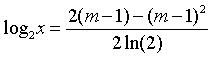
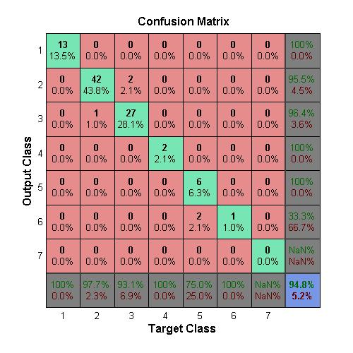
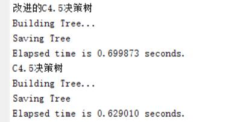

# decision-tree
基于决策树的空气质量分析

# 各个算法性能比较
## C4.5决策树可视化

## 混淆矩阵
### ID3

### C4.5

### LM神经网络

### BP神经网络

## ROC曲线

## PR曲线

## 精确率

# C4.5改进算法
## 1. 降低计算复杂度
引入泰勒中值定理和麦克劳林展开式，对熵值中的对数运算进行变换，优化熵值运算，缩短其运算时间。

## 2. 加入平衡系数λ
引入一个平衡度系数 (平衡度系数 λ( 0 <λ < 1)是一个模糊的概念 ,其大小由决策者根据先验知识或领域知识来确定 ,降低了某些属性的信息熵 ,相应地提高了其他属性的信息熵。

选择最高修正信息增益的属性为当前结点的测试属性 ,该属性的分枝对应于未合并样本子集和复合样本子集。

## 3.分割点优化
C4.5算法对每个分割点都要计算相应的熵值，才能得到最优的分割点，所以在选择最佳的属性分割点时效率较低。为了解决这个问题，引入边界点义和 Fayyad 定理。边界点定义：设序列 L={x1, x2,…, xn} 为升序排列的有序序列，实例 X 所属的类为Cx。 如 果 有 实 例 xi 和 xj（ 其 中 j=i+1）， 且Cxi ≠ Cxj，则边界点 Bp =(xi+xj)/2。

Fayyad定理：连续属性X各个候选分割点对应的信息熵值的最小值一定在边界点Bp上取得。由以上定理可知，连续属性的最优分割点在计算时，只需要通过比较属性值序列在边界点的最小信息熵值，就可以计算出该属性的最大修正信息增益率，减少了候补分割点，因此可以大大提高了计算的效率。

## 混淆矩阵
### 改进C4.5

### C4.5

## ROC曲线

## PR曲线

## 精确率

## 时间效率

